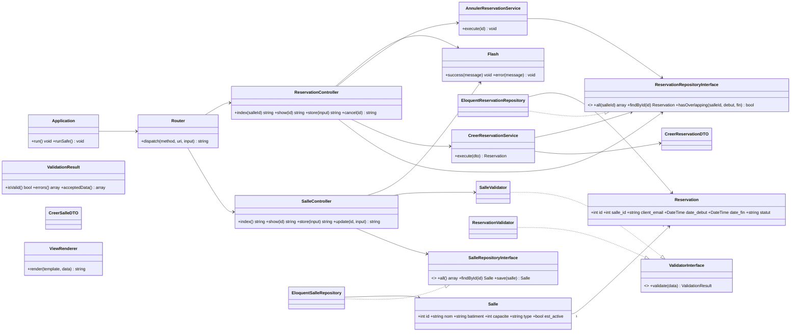

# Diagramme de classes — Gestion des réservations de salles

## Version PlantUML

```plantuml
@startuml
skinparam classAttributeIconSize 0

package "Controller" {
  class DashboardController { +index() : string }
  class SalleController {
    +index() : string
    +show(int id) : string
    +create() : string
    +store(array input) : string
    +edit(int id) : string
    +update(int id, array input) : string
  }
  class ReservationController {
    +index(?int salleId) : string
    +show(int id) : string
    +create() : string
    +store(array input) : string
    +cancel(int id) : string
  }
}

package "DTO" {
  class CreerSalleDTO
  class CreerSalleDTOBuilder { +build() : CreerSalleDTO }
  class CreerReservationDTO
  class CreerReservationDTOBuilder { +build() : CreerReservationDTO }
}

package "Exception" {
  class SalleIndisponibleException
  class ReservationInvalideException
  class ReservationIntrouvableException
}

package "Http" {
  class Router { +dispatch(method, uri, input) : string }
}

package "Model" {
  class Salle {
    +id : int
    +nom : string
    +batiment : string
    +capacite : int
    +type : string
    +est_active : bool
  }
  class Reservation {
    +id : int
    +salle_id : int
    +client_email : string
    +date_debut : DateTime
    +date_fin : DateTime
    +statut : string
  }
}

package "Repository" {
  interface SalleRepositoryInterface {
    +all() : array
    +findById(int id) : ?Salle
    +save(Salle salle) : Salle
  }
  interface ReservationRepositoryInterface {
    +all(?int salleId) : array
    +findById(int id) : ?Reservation
    +hasOverlapping(int salleId, string debut, string fin) : bool
  }
  class EloquentSalleRepository
  class EloquentReservationRepository
}

package "Service" {
  class CreerReservationService { +execute(CreerReservationDTO dto) : Reservation }
  class AnnulerReservationService { +execute(int id) : void }
}

package "Support" {
  class Flash {
    +success(string message) : void
    +error(string message) : void
    +pull() : array
  }
}

package "Validation" {
  interface ValidatorInterface { +validate(array data) : ValidationResult }
  class SalleValidator
  class ReservationValidator
  class ValidationResult {
    +isValid() : bool
    +errors() : array
    +acceptedData() : array
  }
}

package "View" {
  class ViewRenderer { +render(string template, array data) : string }
}

package "Application" {
  class Application {
    +run() : void
    +runSafe() : void
  }
}

SalleController ..> SalleRepositoryInterface
SalleController ..> SalleValidator
SalleController ..> CreerSalleDTOBuilder
SalleController ..> Flash
SalleController ..> ViewRenderer
ReservationController ..> ReservationRepositoryInterface
ReservationController ..> ReservationValidator
ReservationController ..> CreerReservationService
ReservationController ..> AnnulerReservationService
ReservationController ..> Flash
ReservationController ..> ViewRenderer

CreerSalleDTOBuilder ..> CreerSalleDTO : construit
CreerReservationDTOBuilder ..> CreerReservationDTO : construit

SalleValidator ..|> ValidatorInterface
ReservationValidator ..|> ValidatorInterface

EloquentSalleRepository ..|> SalleRepositoryInterface
EloquentReservationRepository ..|> ReservationRepositoryInterface
EloquentSalleRepository --> Salle : manipule
EloquentReservationRepository --> Reservation : manipule

CreerReservationService ..> ReservationRepositoryInterface
CreerReservationService ..> SalleRepositoryInterface
CreerReservationService ..> CreerReservationDTO
CreerReservationService ..> SalleIndisponibleException : leve
AnnulerReservationService ..> ReservationRepositoryInterface
AnnulerReservationService ..> ReservationIntrouvableException : leve

Salle "1" --> "*" Reservation : contient
Reservation "*" --> "1" Salle : appartient

Router ..> SalleController : dispatche
Router ..> ReservationController : dispatche
Router ..> DashboardController : dispatche
Application --> Router
@enduml
```

## Version Mermaid (rendu direct sur GitHub)



## Lecture

- **Couche HTTP** (`Router`, contrôleurs) : reçoit les requêtes, valide, délègue aux services et rend les vues via `ViewRenderer`.
- **Couche métier** (`CreerReservationService`, `AnnulerReservationService`) : applique les règles (pas de chevauchement, salle active) et lève les exceptions du domaine.
- **Couche accès aux données** : contrôleurs et services dépendent des *interfaces* de repository, implémentées par Eloquent — ce qui permet de tester avec SQLite en mémoire.
- **DTO + Builder** : transport immuable des données validées entre le contrôleur et le service.
- **Support** : `Flash` gère les messages de succès/erreur entre deux requêtes.
